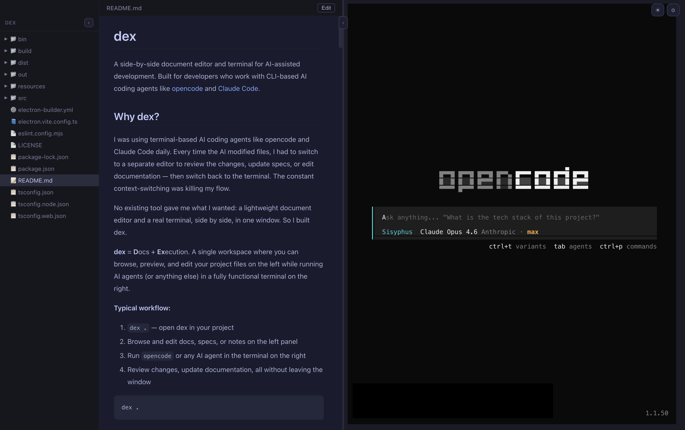
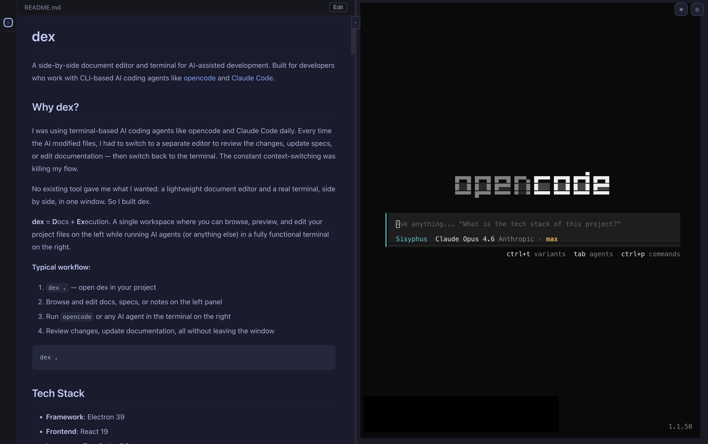
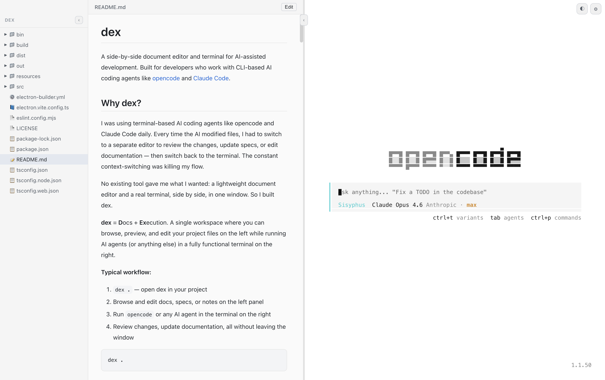
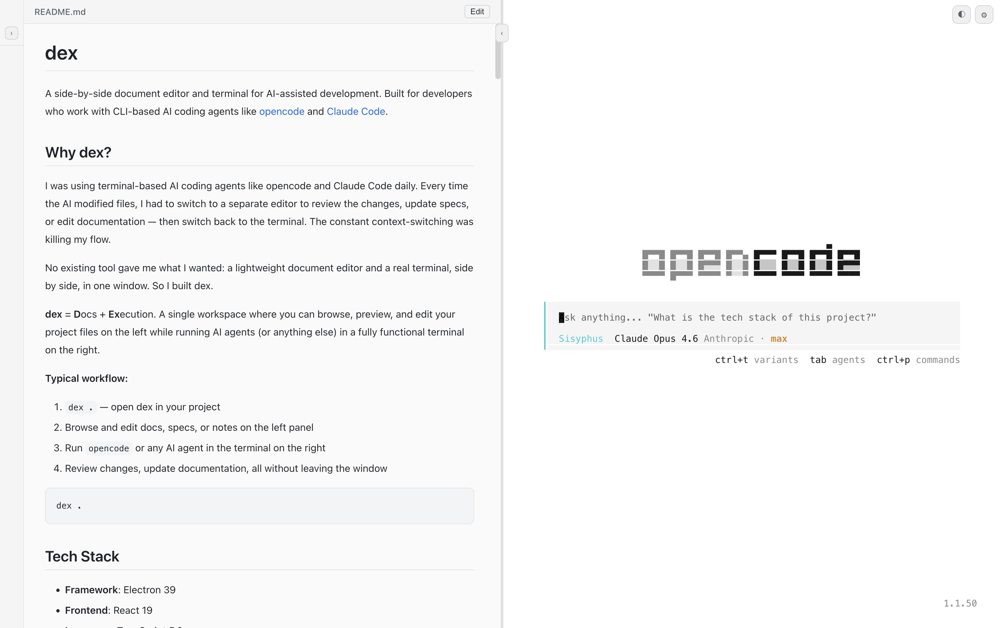

# dex

A side-by-side document editor and terminal for AI-assisted development. Built for developers who work with CLI-based AI coding agents like [opencode](https://github.com/opencodeco/opencode) and [Claude Code](https://docs.anthropic.com/en/docs/claude-code).

## Why dex?

I was using terminal-based AI coding agents like opencode and Claude Code daily. Every time the AI modified files, I had to switch to a separate editor to review the changes, update specs, or edit documentation — then switch back to the terminal. The constant context-switching was killing my flow.

No existing tool gave me what I wanted: a lightweight document editor and a real terminal, side by side, in one window. So I built dex.

**dex** = **D**ocs + **Ex**ecution. A single workspace where you can browse, preview, and edit your project files on the left while running AI agents (or anything else) in a fully functional terminal on the right.

**Typical workflow:**
1. `dex .` — open dex in your project
2. Browse and edit docs, specs, or notes on the left panel
3. Run `opencode` or any AI agent in the terminal on the right
4. Review changes, update documentation, all without leaving the window

```bash
dex .
```

<p align="center">
  
  
</p>
<p align="center">
  
  
</p>

## Tech Stack

- **Framework**: Electron 39
- **Frontend**: React 19
- **Language**: TypeScript 5.9
- **Build Tool**: electron-vite 5
- **App ID**: `com.dex.app`
- **Version**: `1.0.0`
- **Category**: Developer Tools

## Key Features

### 1. Split Panel Layout
The application features a flexible dual-panel architecture designed for maximum screen utility.
- **Side-by-Side View**: A file tree and document viewer on the left, and a terminal on the right.
- **Draggable Divider**: Adjust the workspace ratio with a smooth, animated divider.
- **Collapsible Elements**:
  - The left panel can be collapsed via a toggle button located at the top of the divider.
  - The file tree within the left panel can also be collapsed independently to maximize document viewing area.
- **Constraints**:
  - Minimum left width: 200px.
  - Minimum right width: 300px.
  - Default split: 50/50.
- **Persistence**: Window dimensions (size, position) and the split position are saved across sessions.

### 2. Terminal Emulator
A production-grade terminal implementation using `node-pty` and `xterm.js` v6.
- **Shell Auto-detection**: Automatically detects the user's preferred shell.
  - Unix: Checks `$SHELL`, then falls back to `/bin/zsh`, `/bin/bash`, or `/bin/sh`.
  - Windows: Checks `%COMSPEC%`, then falls back to `powershell.exe` or `cmd.exe`.
- **Advanced Rendering**:
  - Full 256-color support (`TERM=xterm-256color`).
  - Unicode 11 support via `Unicode11Addon` for accurate rendering of box-drawing characters and wide characters.
- **Interactive Features**:
  - Clickable URLs via the Web links addon.
  - `FitAddon` for fluid resizing.
- **Optimization**:
  - Debounced resize events (50ms) to prevent PTY saturation.
  - Double `requestAnimationFrame` logic ensures the terminal container has accurate dimensions before initial rendering.
- **TUI Compatibility**: Fully supports TUI applications like `vim`, `htop`, `opencode`, and other interactive terminal tools.
- **Environment**: Automatically strips `ELECTRON_*` environment variables to prevent child process interference.
- **Scrollback**: Configurable buffer range from 1,000 to 50,000 lines (default 5,000).

### 3. File Tree
A lightweight, efficient file navigator.
- **Lazy Loading**: Directory contents are loaded on demand to handle large projects.
- **Smart Sorting**: Directories are listed first, followed by files in alphabetical order (case-insensitive).
- **Hidden Files**: Supports toggling hidden files (off by default).
- **Default Exclusions**: Automatically ignores noise like `.git`, `.DS_Store`, `node_modules`, `.next`, `.cache`, and `__pycache__`.
- **UI Design**: Fixed width of 220px when expanded, collapsing to a 36px sidebar.

### 4. Document Viewer & Editor
The document panel supports viewing and editing with a toggle between the two modes.

**View Mode** (read-only, optimized rendering):
- **Markdown**: GitHub Flavored Markdown rendering via `marked` + `github-markdown-css`, with syntax-highlighted code blocks via `highlight.js`. Max width 800px.
- **Code**: Syntax highlighting for 30+ languages (TypeScript, JavaScript, Python, Go, Rust, Java, C/C++, Ruby, SQL, YAML, and more). Line numbers and monospace font.
- **Plain Text**: Clean monospace rendering with line numbers.

**Edit Mode** (full CodeMirror 6 editor):
- Toggle between View and Edit with a single click on the header bar.
- Powered by CodeMirror 6 with `basicSetup` — line numbers, bracket matching, auto-indent, search/replace (`Cmd+F`), and more.
- Syntax highlighting for all supported languages via `@codemirror/language-data` (dynamic loading).
- Dark/Light theme sync (One Dark / Standard Light).
- Save with `Cmd+S` — writes directly to disk.
- Unsaved changes indicator (dot next to filename).
- Font family, font size, and word wrap respect Settings.
- Lazy-loaded — the editor chunk is only fetched when entering Edit mode.

**Capabilities & Limits**:
- Maximum file size: 5MB.
- Binary file detection with graceful error messaging.
- Path traversal protection — cannot access files outside the working directory.

### 5. Theme System
A unified theme engine that ensures visual consistency across the UI and terminal.
- **Modes**: Light, Dark, and System.
- **System Synchronization**: Real-time appearance tracking via Electron's `nativeTheme` API.
- **Themed Components**:
  - Terminal: Tokyo Night (Dark) / GitHub (Light).
  - Code Highlighting: highlight.js themes adapt automatically.
  - UI: Driven by CSS custom properties.

### 6. Settings Management
Access settings via `⌘+,` or the gear icon.
- **Interface**: Modal overlay with a backdrop blur effect.
- **Customization Options**:
  - **Theme**: Segmented control for Light/Dark/System.
  - **Typography**: 12 curated monospace fonts — Menlo, Monaco, SF Mono, Consolas, Cascadia Code, Cascadia Mono, JetBrains Mono, Fira Code, Source Code Pro, DejaVu Sans Mono, Ubuntu Mono, Courier New.
  - **Font Size**: Slider control from 8px to 32px (default 14px).
  - **Terminal**: Scrollback buffer slider (1,000–50,000).
  - **Behavior**: Word wrap and hidden files toggles.
- **Persistence**: Settings are stored as JSON at `~/Library/Application Support/dex/settings.json` (on macOS).
- **Real-time Application**: Changes apply instantly without requiring an app restart.

### 7. Application Menu (macOS)
Standard macOS menu integration:
- **dex**: About, Settings, Services, Hide/Quit.
- **File**: Toggle Sidebar (⌘+B), Close.
- **Edit**: Undo, Redo, Cut, Copy, Paste, Select All.
- **View**: Reload, Toggle DevTools, Zoom, Fullscreen.
- **Window**: Standard window management.

### 8. CLI Usage
The `dex` command-line interface allows for quick project launches.
- **Usage**: `dex [path]` (defaults to `.` if no path is provided).
- **Execution Logic**:
  - If the app is installed, it launches the packaged binary.
  - If in development, it runs via `electron-vite`.

## Architecture

```text
src/
├── main/
│   ├── index.ts          # Entry point, window management, IPC handlers, PTY spawn logic
│   └── settings.ts       # JSON-based settings storage and retrieval
├── preload/
│   ├── index.ts          # Safe IPC bridge for renderer
│   └── index.d.ts        # TypeScript definitions for window.api
└── renderer/src/
    ├── main.tsx           # React mounting and global styles
    ├── App.tsx            # Context providers (Theme, Settings) and layout
    ├── components/
    │   ├── SplitPanel.tsx      # Draggable layout with resize logic
    │   ├── FileTree.tsx        # Directory navigation and state
    │   ├── FileTreeItem.tsx    # File/Folder rendering logic
    │   ├── DocumentViewer.tsx  # Multi-mode file viewer/editor (MD/Code/Text + Edit)
    │   ├── CodeMirrorEditor.tsx # CodeMirror 6 editor wrapper (lazy-loaded)
    │   ├── TerminalPanel.tsx   # xterm.js React wrapper
    │   ├── ThemeToggle.tsx     # Toolbar controls
    │   ├── SettingsModal.tsx   # Settings UI with blur overlay
    │   └── ErrorBoundary.tsx   # Application-level crash handling
    └── hooks/
        ├── useTerminal.ts   # Terminal instance lifecycle and addons
        ├── useTheme.ts      # Theme state and system sync
        ├── useSettings.ts   # Settings context + IPC bridge
        └── useFileTree.ts   # File tree state management
```

## IPC Channels

### Terminal
- `terminal:ready`: Notifies the main process the terminal is ready for PTY spawn.
- `terminal:write`: Sends data from renderer to PTY.
- `terminal:resize`: Synchronizes terminal dimensions with PTY.
- `terminal:data`: Streams data from PTY to renderer.
- `terminal:exit`: Handles PTY termination events.

### File System
- `fs:getWorkingDir`: Retrieves the current application context directory.
- `fs:readDir`: Lists files and directories for a given path.
- `fs:readFile`: Safely reads file content for the viewer.
- `fs:writeFile`: Writes file content from the editor (path-validated).

### Settings & Theme
- `settings:getAll`: Fetches all saved configurations.
- `settings:set`: Updates specific settings.
- `settings:getMonospaceFonts`: Returns the list of supported fonts.
- `settings:openFile`: Triggers OS-level file opening.
- `settings:changed`: Event emitted when settings are updated.
- `theme:getResolved`: Returns the current active theme (light/dark).
- `theme:updated`: Event emitted on theme change.

### UI Controls
- `menu:openSettings`: Triggers the settings modal via menu.
- `menu:toggleSidebar`: Toggles the visibility of the sidebar.

## Configuration

The `settings.json` file (located at `~/Library/Application Support/dex/settings.json` on macOS) uses the following schema:

| Field | Type | Default | Description |
|-------|------|---------|-------------|
| `themeMode` | `"light" \| "dark" \| "system"` | `"system"` | Appearance mode |
| `fontFamily` | `string` | `"Menlo, Monaco, \"Courier New\", monospace"` | Monospace font family for terminal and code viewer |
| `fontSize` | `number` | `14` | Font size in pixels (range: 8–32) |
| `terminalScrollback` | `number` | `5000` | Terminal scrollback buffer lines (range: 1,000–50,000) |
| `showHiddenFiles` | `boolean` | `false` | Show dotfiles and hidden patterns in file tree |
| `wordWrap` | `boolean` | `false` | Enable line wrapping in the document viewer |
| `windowBounds` | `object` | `{ width: 1400, height: 900 }` | Persisted window size and position `{ width, height, x, y }` |
| `splitPosition` | `number \| null` | `null` | Left panel width in pixels (`null` = 50% of window) |
| `fileTreeCollapsed` | `boolean` | `false` | Whether the file tree sidebar is collapsed |
| `leftPanelCollapsed` | `boolean` | `false` | Whether the entire left panel is collapsed |

## Security

- **Context Isolation**: Enabled to prevent renderer from accessing sensitive Node.js APIs directly.
- **Node Integration**: Disabled in the renderer process.
- **Sandbox**: Disabled (required for `node-pty` native module communication via the preload script).
- **Path Traversal Protection**: All file system IPC calls validate that the requested path is within the working directory boundary.
- **Environment Scrubbing**: Sensitive Electron environment variables are removed from the terminal process.
- **Safe Navigation**: All external links are opened in the default system browser rather than the app window.

## Error Handling

- **ErrorBoundary**: Wraps the entire React application. On crash, displays a "Reload" button instead of a blank screen.
- **PTY Lifecycle**: Graceful shutdown on app quit, window close, and `before-quit` events with try-catch wrapping.
- **Terminal Resize Validation**: Rejects non-integer or non-positive `cols`/`rows` values before forwarding to PTY.
- **Settings Corruption Recovery**: If `settings.json` is corrupted or unreadable, the app silently falls back to default settings.
- **Binary File Detection**: The document viewer inspects file buffers for null bytes and shows a clear error instead of rendering garbage.
- **File Size Guard**: Files larger than 5MB are rejected with an explicit error message.

## Keyboard Shortcuts

- `⌘ + ,` : Open Settings
- `⌘ + B` : Toggle Sidebar
- `⌘ + S` : Save file (in Edit mode)
- `⌘ + F` : Find/Replace (in Edit mode)
- `Escape` : Close Settings Modal

## Development

### Prerequisites
- Node.js 20+
- npm

### Setup
1. Clone the repository.
2. Install dependencies:
   ```bash
   npm install
   ```

### Scripts
- `npm run dev`: Start electron-vite in watch mode.
- `npm run typecheck`: Run TypeScript compiler check.
- `npm run lint`: Lint the codebase.
- `npm run format`: Format code with Prettier.

## Build

Building `dex` requires native compilation for the `node-pty` module.

- **macOS**: `npm run build:mac` (Outputs `.dmg` and `.app`)
- **Windows**: `npm run build:win` (Outputs `.exe`)
- **Linux**: `npm run build:linux` (Outputs `AppImage` and `.deb`)

Ensure `npmRebuild: true` is set in the `electron-builder` configuration to correctly compile native dependencies for the target platform.

## Dependencies

- **codemirror** + **@codemirror/***: Code editor (state, view, commands, language-data, search, autocomplete, theme-one-dark).
- **@xterm/xterm**: Core terminal emulator.
- **@xterm/addon-fit**: Terminal auto-resizing.
- **@xterm/addon-unicode11**: Wide character and box-drawing support.
- **@xterm/addon-web-links**: Link detection in terminal output.
- **node-pty**: Native pseudoterminal implementation.
- **marked**: Fast Markdown parser for GFM.
- **marked-highlight**: Syntax highlighting integration for code blocks within Markdown.
- **highlight.js**: Multi-language syntax highlighting engine.
- **github-markdown-css**: GitHub styling for Markdown content.

## Troubleshooting

- **Native Module Build Failures**: If `node-pty` fails to build, ensure `node-gyp`, Python, and appropriate build tools (Xcode Tools on macOS, Visual Studio Build Tools on Windows) are installed.
- **TUI Rendering Issues**: If TUI apps look misaligned, check if `Unicode11Addon` is active and the `FitAddon` is padding the terminal correctly.
- **Shell Detection**: If the shell fails to start, dex falls back through a chain of common shell paths. Verify your `$SHELL` environment variable if the wrong shell is spawned.

## License

MIT License

Copyright © 2026 dex. All rights reserved.
